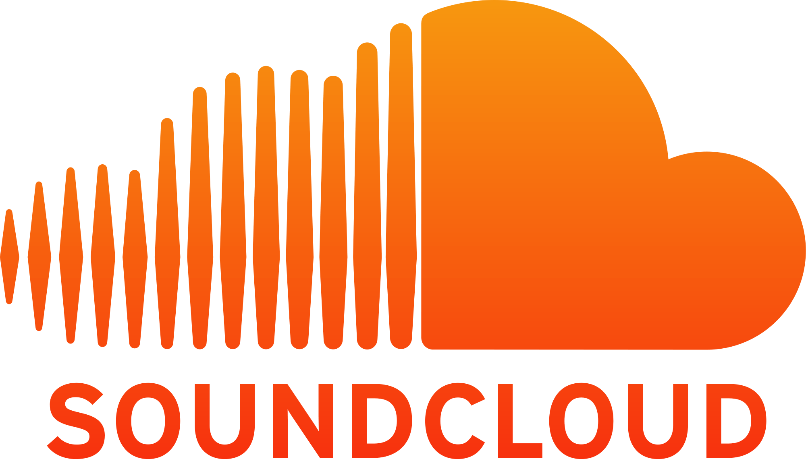

  
   

This repo uses ytdl-core and other dependencies to function.  

# Purpose

**Convert any video, playlist on youtube to audio or video format in their highest quality possible. Also Download SoundCloud songs too :)**

## Usage:
 -Drop youtube video/playlist link. As long as its not private, it will download.  
 -Drop soundloud link.  
 -Search anything on youtube.  
 -Click Audio/Video icon to download.  
 -Profit  

### My Host:
Hosts like Heroku and Repl are fine for testing but performance is not the best when downloading.
[Click Here!](https://ytdl.deniscerri.repl.co/)
